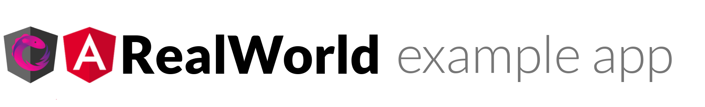

# 

[](https://gitlab.com/spotacard/spotacard/commits/master)

> ### Angular, ngrx/platform, nrwl/nx codebase containing real world examples (CRUD, auth, advanced patterns, etc) that adheres to the [Spotacard](https://github.com/spotacard/spotacard) spec and API.

### [Demo](https://spotacard-af252.firebaseapp.com)&nbsp;&nbsp;&nbsp;&nbsp;[Spotacard](https://github.com/spotacard/spotacard)

This codebase was created to demonstrate a fully fledged fullstack application built with Angular, ngrx/platform, nrwl/nx including CRUD operations, authentication, routing, pagination, and more.

We've gone to great lengths to adhere to the Angular community styleguides & best practices.

For more information on how to this works with other frontends/backends, head over to the [Spotacard](https://github.com/spotacard/spotacard) repo.

# Getting started

This project was generated with [Angular CLI](https://github.com/angular/angular-cli) version 1.6.5 using [Nrwl Nx](https://nrwl.io/nx).

## Nrwl Extensions for Angular (Nx)

<a href="https://nrwl.io/nx"></a>

Nx is an open source toolkit for enterprise Angular applications.

Nx is designed to help you create and build enterprise grade Angular applications. It provides an opinionated approach to application project structure and patterns.

## Quick Start & Documentation

### Requirements

Install the Angular CLI globally

```console
npm install -g @angular/cli
```

or

```console
yarn global add @angular/cli
```

### Initial setup

cd into the local repo directory and run:

```console
npm install
```

or

```console
yarn
```

### Running the application

```console
ng serve
```

### Running tests for the application

```console
ng test
```

[Watch a 5-minute video on how to get started with Nx.](http://nrwl.io/nx)

## Functionality overview

The example application is a social blogging site (i.e. a Medium.com clone) called "Spotacard". It uses a custom API for all requests, including authentication.

**General functionality:**

- Authenticate users via JWT (login/signup pages + logout button on settings page)
- CRU\* users (sign up & settings page - no deleting required)
- CRUD Cards
- CR\*D Comments on cards (no updating required)
- GET and display paginated lists of cards
- Favorite cards
- Follow other users

**The general page breakdown looks like this:**

- Home page (URL: /#/ )
  - List of tags
  - List of cards pulled from either Feed, Global, or by Tag
  - Pagination for list of cards
- Sign in/Sign up pages (URL: /#/login, /#/register )
  - Uses JWT (store the token in localStorage)
  - Authentication can be easily switched to session/cookie based
- Settings page (URL: /#/settings )
- Editor page to create/edit cards (URL: /#/editor, /#/editor/card-slug-here )
- Card page (URL: /#/card/card-slug-here )
  - Delete card button (only shown to card's author)
  - Render markdown from server client side
  - Comments section at bottom of page
  - Delete comment button (only shown to comment's author)
- Profile page (URL: /#/profile/:username, /#/profile/:username/favorites )
  - Show basic user info
  - List of cards populated from author's created cards or author's favorited cards
